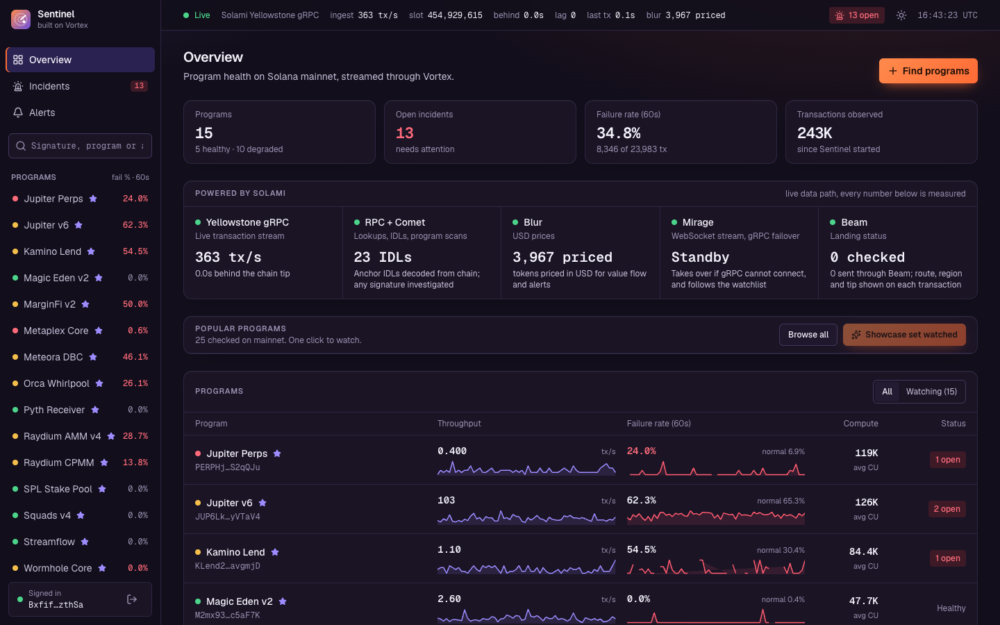
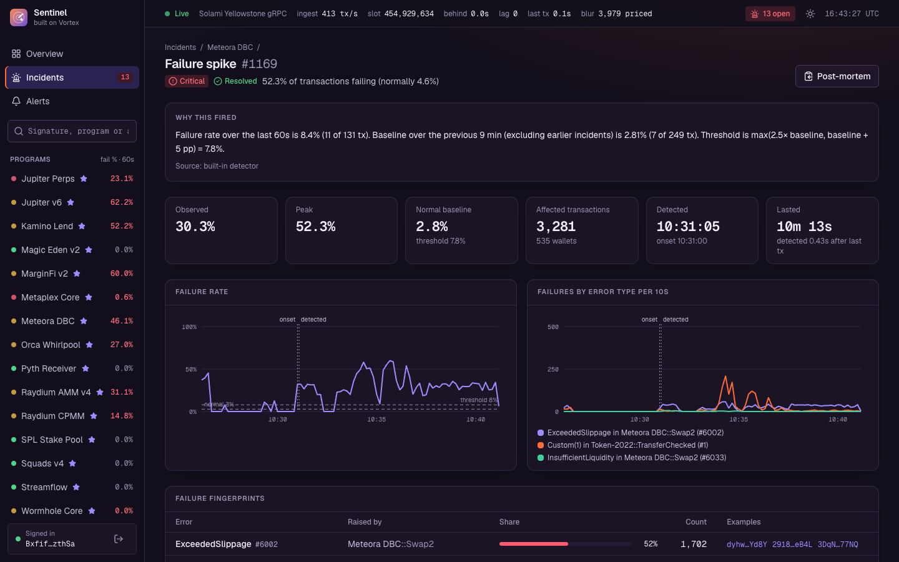
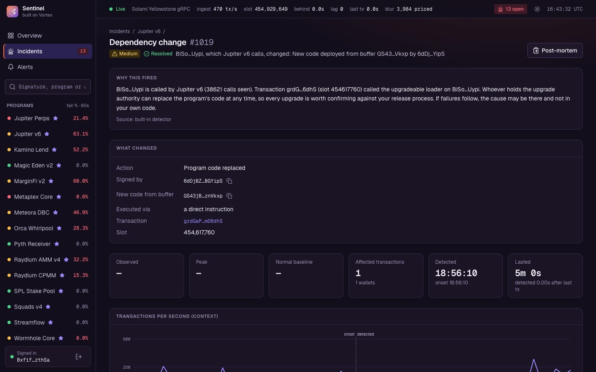
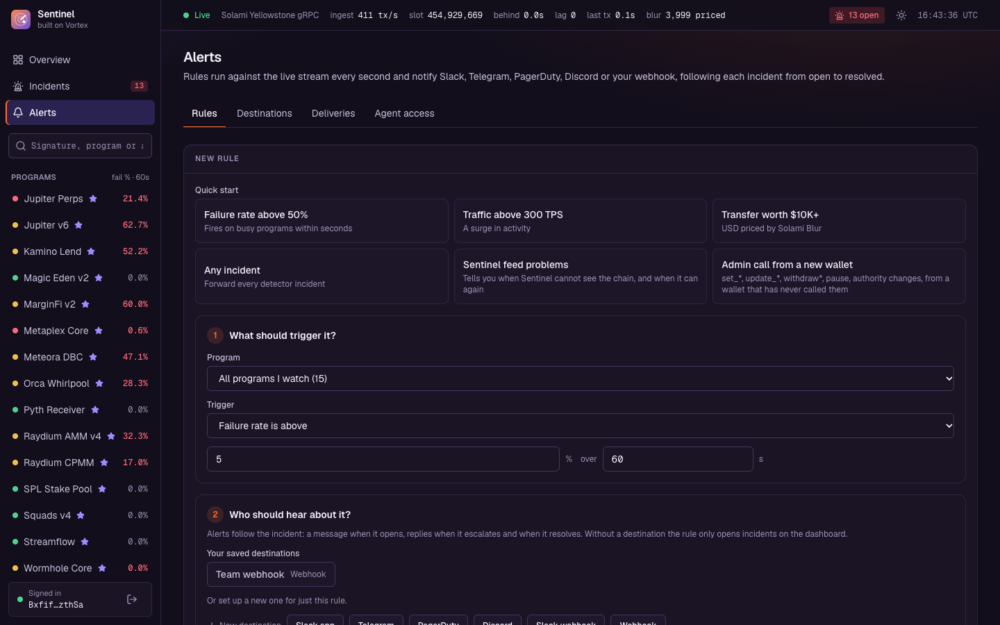
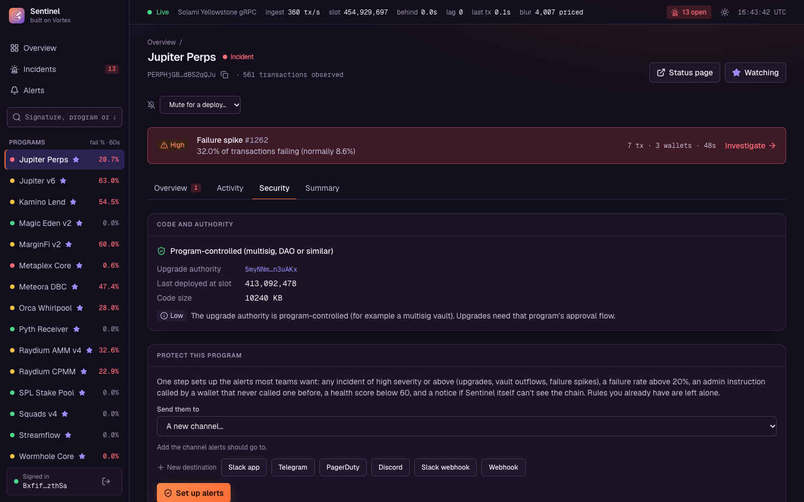
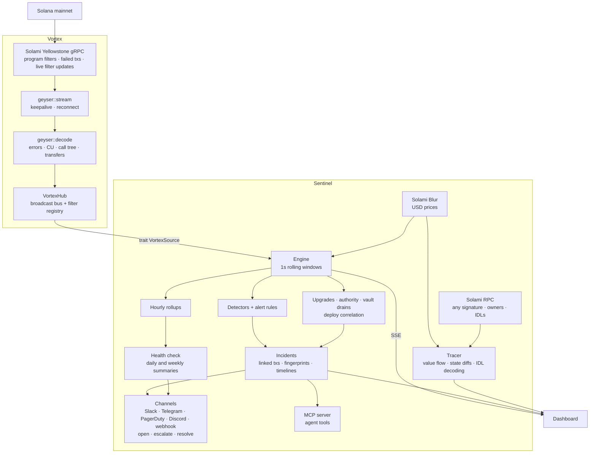

# Vortex Sentinel

**Incidents, not transactions.** Sentinel watches Solana programs on mainnet in real time. When something breaks it tells you which error, in which instruction, since when, for how many wallets, and shows the exact transactions. Then it tells the right people, in Slack, Telegram, PagerDuty, Discord or a webhook, and lets an AI agent triage it.

It runs on [Solami](https://solami.dev) live data (Yellowstone gRPC, RPC, Blur, Beam, Mirage) and on [Vortex](https://github.com/Don-Vicks/vortex), my own open-source Rust library for streaming and decoding Solana transactions.

**[Watch the demo (2:56)](https://youtu.be/tk01rqkEyKs)** · [The story](docs/STORY.md) · [Real incidents it caught](docs/EVIDENCE.md) · [Features](docs/FEATURES.md) · [Alert channels](docs/CHANNELS.md) · [Agent access (MCP)](docs/MCP.md) · [Configuration](docs/CONFIGURATION.md) · [API](docs/API.md)



## Why

When a Solana program starts failing, its team usually finds out from users, then digs through explorers one transaction at a time. And the cause is often not in their own code: any program they call can be upgraded by whoever holds its upgrade key, with no notice. Sentinel turns the transaction stream into incidents that explain themselves, and watches what is being done *to* a program, not only its traffic.

## What it does

- **Explainable detection.** No ML. Each detector compares a short window against the program's own baseline and states the rule it applied, with the numbers: failure-rate spikes, one error type surging, activity spikes and stops, compute spikes, large transfers by amount or USD value.
- **Failure fingerprints.** Every failed transaction is attributed to the deepest failing frame of its call tree, as `program::instruction → error`, with names and messages from the program's on-chain Anchor IDL. For example: "52% of failures are `ExceededSlippage` in `Meteora DBC::Swap2`".
- **Watches the program, not only its traffic.** Program upgrades and authority changes (including multisig executions), vault drains, one wallet taking over a program's traffic, admin calls from a wallet that never made one, Anchor events, and upgrades of the programs yours calls.
- **Investigate any transaction.** A plain-language narrative, value flow priced in USD, net balance changes, the program call tree with compute, decoded arguments and named accounts.
- **Alerts that follow the incident.** Opened, escalated, resolved, in one thread or one page per incident. Rules can match failure rates, transfers, decoded instructions and events, health scores, a Squads multisig acting, or Sentinel's own feed stalling.
- **Agent access over MCP.** Claude, Cursor or any MCP client can list programs, diagnose incidents, read post-mortems, and (with a write token) protect a program in one step. Channel secrets never pass through the agent.
- **Health, summaries and a public status page.** A 0-100 health score where every check shows its rule and numbers, daily and weekly summaries, a status page and a README badge for each program, and Prometheus metrics.
- **Sign in with a Solana wallet.** No passwords, nothing on chain. Each wallet has its own watchlist, rules and delivery log.

## See it

| | |
|---|---|
|  **A failure spike explains itself**: the rule that fired with its numbers, the baseline, the timeline and which error in which instruction. |  **An upstream upgrade**: a program that seven watched programs call was redeployed, and who signed it. |
|  **Alerts in three steps**: pick a trigger, pick where it goes (saved destinations, with a send-test button), name it. |  **Security tab**: who can upgrade the program, rules suggested from its IDL, and the programs it calls. |

## Real incidents it caught

Both are recorded by Sentinel on live mainnet, with the on-chain facts to check them against, in [docs/EVIDENCE.md](docs/EVIDENCE.md):

- **October 8, 2026.** A program that seven of the fifteen watched programs call was redeployed. Sentinel saw the upgrade on the Yellowstone stream and flagged all seven dependents about a second after the block, and named the key that signed it (an ordinary wallet, no multisig).
- **October 9, 2026.** A critical failure spike on Meteora DBC: 52.3% of transactions failing against a normal 4.6%, across 3,281 transactions and 535 wallets, detected in 434 ms and attributed to `Swap2 → ExceededSlippage`. Two of its example transactions are checked against the chain in the evidence file.

## How it works



One Rust process (Tokio, Axum, SQLite) and a React dashboard. Sentinel reaches Vortex through one small trait, [`VortexSource`](src/source.rs).

## Built on Solami

Each Solami product does real work in the data path. Details and measurements in [docs/SOLAMI.md](docs/SOLAMI.md).

| Product | What Sentinel uses it for |
|---|---|
| **Yellowstone gRPC** | The live transaction stream: one subscription over every watched program, failed transactions included. Filters update over the open stream with no reconnect. |
| **RPC + Comet** | Loads each program's Anchor IDL, investigates any signature, resolves account owners, finds the programs an upgrade authority controls, measures how far behind the chain the stream is, and loads recent history so detectors have a baseline at once. |
| **Blur** | Prices tokens in USD for value flow, narratives and USD transfer alerts. |
| **Mirage** | Failover for the stream over a WebSocket. Sentinel creates and maintains its own subscription (it needs the `MirageView`, `MirageManage` and `MirageStream` permissions) and switches over if gRPC cannot connect. |
| **Beam** | Shows how a transaction landed: Jito or direct, region, tip, and forwarding time. Read side only; Sentinel does not send through Beam. |

## Quick start

You need a Solami API key. [Sign up](https://solami.dev/signup); the Pro trial includes gRPC.

**Docker**

```bash
git clone https://github.com/Don-Vicks/sentinel && cd sentinel
cp .env.example .env        # add your Solami key
docker compose up --build
```

**From source** (Rust 1.75+, Node 18+, `protoc`)

```bash
cp .env.example .env
cd web && npm install && npm run build && cd ..
cargo run --release
```

Open <http://localhost:8080>. Paste a program ID, an upgrade-authority address or a transaction link into the finder and click **Watch**. Detectors judge a program against its own baseline, so they learn for about five minutes first (recent history loaded over RPC shortens that).

For a 15-program demo set with a health checklist, run `./scripts/demo.sh`.

The minimum configuration:

| Variable | Purpose |
|---|---|
| `YELLOWSTONE_ENDPOINT` | Solami gRPC endpoint, e.g. `https://grpc.solami.dev` |
| `YELLOWSTONE_TOKEN` | Your Solami API key |
| `SOLANA_RPC_URL` | Solami RPC URL, e.g. `https://rpc.solami.dev/sol?api_key=...` |
| `BLUR_API_KEY` | Optional. A key with the `DataApi` permission, for USD prices (falls back to the gRPC key) |

Every other setting, hosting notes (Docker, Railway) and the full environment table are in [docs/CONFIGURATION.md](docs/CONFIGURATION.md). Keys stay in `.env`, which is git-ignored; they are masked in the API and scrubbed from error messages.

## Alerts

| Channel | Best for | Setup |
|---|---|---|
| **Slack app** | Team chat. An incident's updates stay in one thread | [Slack](docs/CHANNELS.md#slack) |
| **Telegram** | Mobile. An Acknowledge button, and the chat can ask `/status`, `/incidents`, `/health`, `/mute` | [Telegram](docs/CHANNELS.md#telegram) |
| **PagerDuty** | Paging. One alert per incident, resolved when it clears | [PagerDuty](docs/CHANNELS.md#pagerduty) |
| **Discord** | Community or team channels | [Discord](docs/CHANNELS.md#discord) |
| **Webhook** | Your own tooling. JSON with an idempotency header | [Webhook](docs/CHANNELS.md#webhook) |

Telegram on a real bot, end to end (alert, one-tap Acknowledge, `/status`): [watch the 35-second clip](https://youtu.be/SWyeZFxL5_g). Each channel has a **Send test** button. Save a channel once as a destination and reuse it in any rule. Full guide with troubleshooting: [docs/CHANNELS.md](docs/CHANNELS.md).

## Agent access (MCP)

Create a token under **Alerts, Agent access**, then connect a client:

```bash
claude mcp add --transport http sentinel http://localhost:8080/mcp \
  --header "Authorization: Bearer snt_..."
```

Then ask: "Which of my programs is unhealthy, and why?", "Triage incident 1019", "Set up protection for this program, reusing my Slack channel". 23 tools, resources and prompts, with read and write scopes; the agent reuses an existing rule's channels, so a bot token never passes through it. See [docs/MCP.md](docs/MCP.md).

## Built on Vortex

Vortex is not a third-party dependency. It is [my own open-source Rust project](https://github.com/Don-Vicks/vortex): a Solana transaction stack with a Yellowstone client that I extended for Sentinel (the decoder, the hub that fans decoded transactions out, and the Mirage transport). Which parts existed before and which were written for this submission, with commit links, is in [docs/VORTEX.md](docs/VORTEX.md).

## Tests

```bash
cargo test
```

131 tests, many of them against real mainnet transactions and accounts (a failed Pump.fun Buy, Squads v4 and v5 multisigs, the real Pump.fun IDL), mock servers for every alert channel and for Blur, and the HTTP router end to end. What each suite checks: [docs/TESTING.md](docs/TESTING.md).

## Limits

Timestamps are Sentinel's receive time at `Processed` commitment. Argument and event decoding need a program's Anchor IDL. USD values use Blur's last price, and thinly traded tokens never trigger alerts. Telegram is verified end to end on a real bot; Slack, PagerDuty and Discord are tested against mock servers and the real services' error responses, so check your own credentials with **Send test**. The full list: [docs/LIMITS.md](docs/LIMITS.md).

## Documentation

| | |
|---|---|
| [docs/STORY.md](docs/STORY.md) | The upgrade nobody announced: why Sentinel exists, and the day it caught one |
| [docs/FEATURES.md](docs/FEATURES.md) | Everything Sentinel does, in detail |
| [docs/CHANNELS.md](docs/CHANNELS.md) | Setting up Slack, Telegram, PagerDuty, Discord and webhooks |
| [docs/MCP.md](docs/MCP.md) | Connecting an agent; every tool |
| [docs/EVIDENCE.md](docs/EVIDENCE.md) | Real incidents caught on mainnet, with on-chain proof |
| [docs/SOLAMI.md](docs/SOLAMI.md) | How each Solami product is used, and measured performance |
| [docs/CONFIGURATION.md](docs/CONFIGURATION.md) | Running, hosting and every environment variable |
| [docs/API.md](docs/API.md) | The HTTP API |
| [docs/TESTING.md](docs/TESTING.md) | What the tests cover |
| [docs/LIMITS.md](docs/LIMITS.md) | What Sentinel does not do |
| [docs/VORTEX.md](docs/VORTEX.md), [docs/VORTEX_AUDIT.md](docs/VORTEX_AUDIT.md) | The library it is built on |

## License

Licensed under either of [MIT](LICENSE-MIT) or [Apache-2.0](LICENSE-APACHE), at your option.
