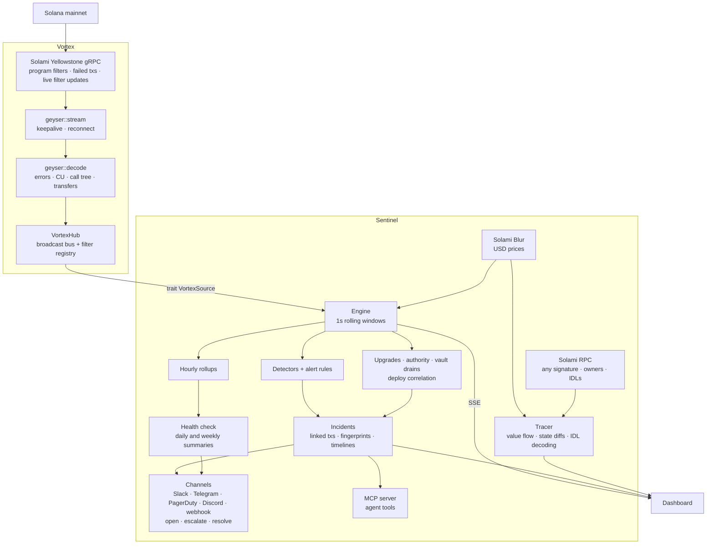

# Vortex Sentinel

**Incidents, not transactions.** Sentinel watches a Solana program on mainnet in real time. It tells you when something breaks, which error is breaking it, which instruction, how many wallets are affected, and the exact transactions. Then it pages you.

It runs on top of [Vortex](https://github.com/Don-Vicks/vortex), my own Solana transaction stack. Vortex handles the Solami stream and decodes each transaction. Sentinel turns that stream into metrics, incidents, investigations and alerts. [What is Vortex, and what's new for this submission?](#built-on-vortex)

<!-- Demo video and screenshots: added after the live mainnet recording. -->



## What it does

- **Live program health.** TPS, failure rate against its baseline, compute units, unique signers and fees, updated every second. The transaction feed streams in as it lands.
- **Failure fingerprints.** Every failed transaction is attributed to the deepest failing frame in its call tree, as *program::instruction → error* (Anchor error names come from logs). For example: "83% of failures are `TooLittleSolReceived` in `Pump.fun::Sell`".
- **Explainable detection.** No ML. Each detector compares a short window against a trailing baseline and states the rule it applied with real numbers:
  - failure-rate spike
  - error-type spike: one error the monitored program itself raised surging against its own baseline, or a never-seen one appearing, even when the overall failure rate looks normal. The threshold uses how much that error actually swings from minute to minute, and it must account for at least 1% of traffic. Errors from other programs in the same transactions (a router's downstream pools, a bot's own program) count toward the failure rate but don't open incidents of their own
  - activity spike (mean + zσ)
  - activity stopped
  - compute spike
  - large transfer, by amount per asset or by USD value (Blur-priced, liquid tokens only)

  Seconds inside an open incident are left out of later baselines, so one incident doesn't mask the next.
- **It doesn't blame programs for its own blindness.** Slots arrive several times a second, so a chain tip that stops advancing means the feed is down, not that every program went quiet. Sentinel pauses all detectors, keeps those seconds out of every baseline, shows "Feed stalled" in the status bar, and holds off for 90 seconds after recovery. Vortex also reconnects any gRPC stream that goes 30 seconds without a message. A program that goes quiet while the chain keeps moving still raises "Activity stopped".
- **Per-instruction health.** Volume, failure rate and compute per instruction (Buy, Sell, …) over the last 5 minutes.
- **Incident timelines.** The metric around each incident, with baseline, threshold, onset, detection and resolution markers, plus each error type's count over time. The timeline is saved with the incident when it resolves.
- **Anchor IDL decoding.** Sentinel fetches each program's IDL from chain (current and legacy formats). It names instruction accounts (`bonding_curve`, `user`, …), decodes arguments (`amount`, `max_sol_cost`), and translates bare custom error codes into names and messages.
- **Incidents** link to the actual transactions (stored, so they survive the in-memory window). They record affected wallets, onset, peak, detection latency, and auto-resolve.
- **Investigation.** For any transaction, Sentinel shows the items below. Recent and incident-linked transactions come from memory or SQLite; any other signature is fetched through Solami RPC and run through the same Vortex decoder.
  - a plain-language narrative
  - value flow between labelled parties (PDAs are resolved to their owner program through RPC)
  - net balance changes
  - the program call tree with per-program compute
  - account state diffs, instructions and logs
- **Alert rules.** Supported conditions: failure rate, failed count, TPS, avg or max compute over a window, single transfers above a size or a USD value, or any incident above a severity. Each rule can open an incident, notify one or more channels (Slack, Telegram, PagerDuty, Discord or a webhook), or both. Every delivery is logged with its channel, event (opened, updated, resolved, test or summary), status and latency. [More below.](#watch-the-program-not-only-its-traffic)
- **Accounts: Sign-In With Solana.** Your wallet signs a one-time message (domain, nonce, 5-minute expiry). There are no passwords and nothing goes on chain. Each wallet has its own watchlist, alert rules, webhooks and delivery log; a rule only fires for programs its owner watches. Streaming and detection are shared per program, so everyone watching Pump.fun sees the same incidents. Browsing is public and read-only; watching programs and managing alerts need a signed-in wallet.
- **Stream health.** The dashboard shows ingest tx/s, current slot, tip lag in slots, time since the last transaction, and events dropped.

## Watch the program, not only its traffic

Failure rates and volume say how a program is behaving. These say what is being done *to* it, and tell the right people:

- **Alerts follow the incident, in Slack, Telegram, PagerDuty, Discord or a webhook.** A rule can notify several channels, each with its own minimum severity (page on critical, chat on medium). The first message says what broke: the top failing `program::instruction → error`, wallets affected, how fast it was detected. An escalation and the resolution reply to that message in Telegram, and PagerDuty triggers and resolves one alert per incident, so nobody is paged twice and nothing is left open. Bot tokens and routing keys are stored server-side, masked in the API and scrubbed from error text.
- **Program upgrades and authority changes.** Sentinel reads the upgradeable loader's instructions, including ones a multisig executes through CPI, and opens an incident when a watched program is upgraded, its upgrade authority moves, it is made immutable or it is closed. The program page shows who can upgrade it now: a single wallet (flagged), a program-controlled authority such as a multisig, or nobody.
- **Deploy correlation.** An incident that starts within 30 minutes of an upgrade carries it as evidence: "this began 74s after the program was upgraded", in the explanation, the alert and the post-mortem.
- **Vault drains.** Name a program's treasury or vault accounts (Sentinel suggests likely ones from traffic) and it opens an incident when one loses a set share of its balance, or a set dollar amount, within ten minutes. Deposits offset withdrawals, so ordinary churn is not an incident.
- **Alerts on what an instruction was asked to do.** Match a call by name (`withdraw`, `set_*|update_*`), by decoded arguments (`args.amount > 1000000000`), by named accounts (`accounts.authority = …`) or by signer, using the program's on-chain IDL. "First time this wallet has called it" turns the same rule into an admin-call-from-a-stranger alarm.
- **Alerts on what the program said it did.** Anchor events (`emit!` and `emit_cpi!`) are decoded with the program's IDL and matched by name and field (`fields.sol_amount > 60000000`, `fields.is_buy = true`), and the Activity tab lists the latest ones.
- **Dependencies.** Sentinel learns which programs yours calls (oracles, AMMs, routers) from its call trees, watches the busiest for upgrades, and when trouble starts soon after one it says so: "began 74s after Jupiter, a program yours calls, was upgraded". Squads multisig upgrades are recognised and named, with the member who signed and how many signatures the multisig requires.
- **One wallet taking over.** A fee payer that suddenly sends most of a program's traffic, well above that program's own norm, opens an incident. A program that is always mostly bots is left alone.
- **Health check.** A 0-100 score from separate checks (failure rate against its baseline, open incidents, transactions arriving, compute, funds, decoding coverage, upgrade authority). Each states the rule it applied and the numbers it saw, and a check with nothing to judge says so instead of passing.
- **Daily and weekly summaries.** What the program did: transactions and trend, success rate, unique wallets, value moved, largest transfers, top instructions and errors, incidents with time to detect and resolve, program changes, and what is worth doing next. Built from stored hourly rollups, so it survives restarts. Read it on the dashboard or schedule it to any chat channel.
- **Post-mortems and diagnosis.** Any incident exports a markdown post-mortem, and a deterministic diagnosis names the likely cause, how confident that is and why, similar earlier incidents, and next steps. It is built only from recorded data.
- **Telegram, both ways.** Incident messages carry an Acknowledge button, and the chat can ask `/status`, `/incidents`, `/health`, `/summary 7d`, `/mute 30m`, `/ack 1001`. Sentinel only answers chats a rule already sends to, and only about programs that rule's owner watches.
- **Maintenance windows.** Mute a program for a deploy: notifications are held and the delivery log says "Held", incidents are still recorded, and a resolution is not sent for an incident nobody heard begin.
- **Rules about Sentinel itself and about keepers.** Be told when the feed stalls or RPC keeps failing (and when it recovers), when the health score drops below a number, or when a wallet's SOL balance runs low.
- **Warm start.** Add a program and Sentinel loads its last 15 minutes over RPC, so detectors have a baseline at once instead of after five minutes.
- **One step to protect a program.** The usual rules (high-severity incidents, failure rate, admin calls from new wallets, health, feed problems) on the channel you choose, without duplicating any you have.
- **A public status page and badge.** `/status/<program>` shows health, 7-day uptime and recent incidents to anyone; `/badge/<program>.svg` is a README badge. `/metrics` exposes everything to Prometheus.
- **An MCP server** so an agent can use all of this. See [docs/MCP.md](docs/MCP.md).

## Built on Vortex

Vortex is not a third-party dependency. It is [my own open-source Rust project](https://github.com/Don-Vicks/vortex), the same author and the same GitHub account. I started it in June as a transaction execution stack: Jito bundles, a tip engine and failure recovery. Its Yellowstone client was already there, and Sentinel's needs went well past it, so I extended Vortex and kept it as the ingest library. Keeping the two apart means Sentinel has no stream-ingest code of its own, which is the point of the audit in [`docs/VORTEX_AUDIT.md`](docs/VORTEX_AUDIT.md). Its Blur, RPC and Beam calls are in this repo.

**What existed before this bounty.** The Yellowstone gRPC client with reconnect, and the transaction-sending stack. Sentinel doesn't use the sending side.

**What I wrote for this bounty (Sep 28 – Oct 1).** 1,842 added lines in Vortex (tests and examples included), all in public commits:

| Piece | Commit |
|---|---|
| Decoder: errors, compute, call tree from logs, SOL/SPL transfers, address lookup tables, version 1 transactions | [`4571b95`](https://github.com/Don-Vicks/vortex/commit/4571b95) |
| `VortexHub`: fan-out of decoded transactions and live program filters | [`4571b95`](https://github.com/Don-Vicks/vortex/commit/4571b95) |
| Rebuilding Yellowstone frames from JSON-RPC, plus tests on real mainnet transactions | [`6973c2d`](https://github.com/Don-Vicks/vortex/commit/6973c2d) |
| Base64 instruction data (6x faster decode) | [`2d252c3`](https://github.com/Don-Vicks/vortex/commit/2d252c3) |
| Solami Mirage WebSocket transport | [`4cbc733`](https://github.com/Don-Vicks/vortex/commit/4cbc733), [`c11de1c`](https://github.com/Don-Vicks/vortex/commit/c11de1c) |

**What lives in this repo.** Everything that makes it a product: about 12,400 lines of Rust (including the unit tests inside each file) for the detectors, rolling metrics, incident engine, investigation and tracing, Anchor IDL decoding, alert channels, upgrade and vault watching, rollups, health and summaries, the MCP server, wallet sign-in, the finder, Blur pricing and Beam lookups, plus about 3,400 lines of integration tests and examples and a 5,500-line React dashboard. Sentinel reaches Vortex through one small trait, [`VortexSource`](src/source.rs).

**Third-party pieces,** all standard: the Solana SDK, the Yellowstone protocol definitions (`yellowstone-grpc-proto`), Tokio, Axum, SQLite and React. The data comes from Solami.

## Numbers

Measured with `cargo run --release --example bench` on real mainnet Pump.fun transactions, one core, Apple M-series laptop:

| Path | Throughput |
|---|---|
| Vortex decoder (Yellowstone frame → `VortexTransaction`) | ~13,000 tx/s (≈75 µs per Pump.fun transaction) |
| Sentinel engine (metrics, detectors, rules, incident linking into SQLite) | ~45,000 tx/s, with a failure storm in progress |

Pump.fun, one of the busiest programs on Solana, runs well below both. Detection runs on a 1-second tick. Each incident records its own detection latency, measured from the triggering transaction reaching Sentinel.

**Live on Solami gRPC (Oct 1, 2026),** Pump.fun and Jupiter v6 together, over a 370 ms round-trip link:

| | |
|---|---|
| Throughput | up to about 570 tx/s combined, and 163,000 transactions in 8 minutes with none dropped |
| Freshness | 0 slots behind the chain tip, measured against the tip read over RPC every 5 seconds (shown as "behind" in the status bar) |
| Detection latency recorded on incidents | 25 to 680 ms |
| Token prices | about 4,000 mints priced through Blur within 8 minutes |

**What the stream taught us.** On a long-latency link the default HTTP/2 window (64 KB) caps one stream at window ÷ round-trip time, about 170 KB/s here. With default settings the same subscription delivered 293 tx/s and ran about 25 seconds behind the chain; Solami's buffer filled and the server dropped the connection every minute or two. Vortex's client now uses 16 MB / 32 MB windows, adaptive windowing and gzip, which delivered 540 to 640 tx/s and 0 to 11 seconds of lag in the same test. The remaining drops are the server's buffer policy (`grpc_buffer_size`), which is an account setting. Run Sentinel close to the endpoint if you can; a hosted instance in the same region removes most of this.

Both programs fail 55 to 80% of the time in steady state, mostly arbitrage bots losing races, so a failure-rate alert has to judge them against their own baseline, not a fixed number. Tuning on this traffic is what produced the error-spike rules above: the first untuned run opened 23 incidents in ten minutes, the tuned one 7 in seventeen.

## How Solami is used

| Solami product | Role |
|---|---|
| **Yellowstone gRPC** | The primary data path. One subscription carries slots plus a named transaction filter over every monitored program (`account_include`, failed transactions included). Adding a program in the UI re-sends the filter over the open stream, with no reconnect. The stream answers pings and reconnects with backoff. If it can't connect, Mirage takes over (below). |
| **Blur** | `POST /data/token/price` prices every mint Sentinel sees move, in batches of up to 1000. A new mint is priced within about a second; known ones refresh every 30s. USD appears on the live feed, value-flow edges, balance changes and narratives. It also powers the USD large-transfer detector and "transfer worth ≥ $X" rules. Tokens under $10K liquidity are displayed but never trigger alerts, since one trade can move their price arbitrarily. |
| **RPC** | Anchor IDLs are fetched from chain with `getAccountInfo`. `getTransaction` for investigating any signature (rebuilt into a Yellowstone frame, decoded by Vortex). `getMultipleAccounts` resolves the owners of accounts in a trace, so a vault shows up as "Pump.fun account" rather than a raw address. The canary example sends controlled demo transactions through it. The finder's "which programs does this authority upgrade?" reads the upgradeable loader with `getProgramAccountsV2` (Solami requires pagination on a program this large). Listing an authority's programs takes about a second on Solami; finding the owner of each one is a scan of the whole loader, so those run in parallel in the background, the page fills in as they land, and every answer is cached for good. Measured on one real authority with 11 programs: all resolved in about 7 seconds on Solami's RPC, against about 26 seconds on the public RPC; a repeat takes milliseconds. |
| **Mirage** | Failover for the stream. Mirage sends the same Yellowstone `SubscribeUpdate` frames over a WebSocket, so Vortex decodes them with the same code as gRPC. Sentinel sets it up itself: given a key with the `MirageView`, `MirageManage` and `MirageStream` permissions, it finds or creates one subscription named "sentinel", keeps its filter equal to the programs being watched (failed transactions included), and builds the stream URL. After repeated gRPC connection failures it switches over, shows "Solami Mirage (gRPC failover)" in the status bar, and retries gRPC every two minutes. Without those permissions Mirage stays off and nothing else changes. Set `SENTINEL_TRANSPORT=mirage` to use it as the primary, or `SENTINEL_MIRAGE=off` to disable it. |
| **Beam** | Read side only. For any transaction, `GET /swqos/tx/{signature}` shows whether Beam carried it and how it landed: Jito or direct to a leader, region, tip, and how long Beam took to forward it. Transfers to Beam's tip accounts (`GET /onchain/tip-addresses`) are called out in the narrative. Both endpoints are public and need no key. Sentinel does not send through Beam; that needs a swQoS key and a funded wallet. |

## Run it

You need a Solami API key. [Sign up](https://solami.dev/signup); the Pro trial includes gRPC.

### Docker (one command)

```bash
git clone https://github.com/Don-Vicks/sentinel && cd sentinel
cp .env.example .env        # add your Solami key
docker compose up --build
```

### Railway

The repo deploys as-is (`Dockerfile` + `railway.toml`). Create a service from the repo, then:

1. **Variables:** `YELLOWSTONE_ENDPOINT`, `YELLOWSTONE_TOKEN`, `SOLANA_RPC_URL`, and `BLUR_API_KEY` for dollar values. Optionally `SENTINEL_PROGRAMS` (comma-separated program IDs to watch at startup).
2. **Volume:** add one mounted at `/data`, so incident history survives restarts. (A Dockerfile `VOLUME` instruction is not used because Railway rejects it.)
3. **Domain:** generate one, then set `SENTINEL_PUBLIC_URL` to it (`https://...`). Wallet sign-in is bound to that address.
4. **Behind the proxy:** set `SENTINEL_TRUST_PROXY=1` so per-IP rate limits see real client addresses.

The port comes from `SENTINEL_PORT`, else Railway's `PORT`, else 8080. An always-on instance pays for every byte it streams from Solami, so watch a small set of programs. If several instances share one Solami account, give each its own `MIRAGE_LABEL`.

### Demo mode (from source, one command)

```bash
cp .env.example .env        # add your Solami keys
./scripts/demo.sh           # builds, starts the API and dashboard on :8080, prints a health checklist
```

It watches a 15-program showcase set, starts from a fresh database (`--keep` to keep it) and stops on Ctrl+C. See [docs/DEMO.md](docs/DEMO.md).

### From source

Prerequisites: Rust 1.75+, Node 18+, and `protoc` (Vortex compiles Jito protos). Cargo pulls Vortex from [Don-Vicks/vortex](https://github.com/Don-Vicks/vortex) automatically.

```bash
cp .env.example .env
cd web && npm install && npm run build && cd ..
cargo run --release
```

Open http://localhost:8080. Pump.fun is monitored out of the box; add any program ID from the Overview page. Detectors arm after a five-minute baseline, so they judge a program against its own real behaviour.

### Environment

| Variable | Default | Purpose |
|---|---|---|
| `YELLOWSTONE_ENDPOINT` | — | Solami gRPC endpoint, e.g. `https://grpc.solami.dev` |
| `YELLOWSTONE_TOKEN` | — | Solami API key (sent as `x-token`) |
| `SOLANA_RPC_URL` | — | Solami RPC URL, used for owner labels in traces and by the canary |
| `BLUR_API_KEY` | `YELLOWSTONE_TOKEN` | Solami key with the `DataApi` permission, for USD prices. Leave unset to fall back to the gRPC key |
| `BLUR_API_URL` | `https://api.solami.dev` | Blur REST base URL |
| `BEAM_API_URL` | `https://api.solami.dev` | Base URL for Beam landing and tip lookups |
| `MIRAGE_API_KEY` | `BLUR_API_KEY`, then `YELLOWSTONE_TOKEN` | Key for Mirage, which needs `MirageView`, `MirageManage` and `MirageStream`. Sentinel creates and maintains the subscription; no URL needed |
| `MIRAGE_STREAM_URL` | — | Manual override: a ready-made stream URL (`wss://ws.solami.dev/mirage/stream/{id}?api_key=…`). Not needed normally |
| `SENTINEL_MIRAGE` | `auto` | Set to `off` to disable Mirage failover |
| `MIRAGE_LABEL` | `sentinel` | Name of this instance's Mirage subscription; give each instance on one account its own |
| `PORT` | — | Used when `SENTINEL_PORT` is unset (hosting platforms set it) |
| `SENTINEL_TRANSPORT` | `grpc` | Set to `mirage` to use Mirage as the primary transport |
| `SENTINEL_PROGRAMS` | — | Comma-separated program IDs to monitor at startup |
| `SENTINEL_PORT` | `8080` | HTTP port (API + dashboard) |
| `SENTINEL_DB` | `sentinel.db` | SQLite file |
| `SENTINEL_PUBLIC_URL` | `http://localhost:8080` | Base URL for incident links in webhooks |
| `SENTINEL_ADMINS` | — | Comma-separated operator wallets. Only they can change shared detection settings, and they skip the caps below |
| `SENTINEL_MAX_WATCHED` | `10` | Programs one wallet can watch |
| `SENTINEL_MAX_RULES` | `25` | Alert rules one wallet can own |
| `SENTINEL_AUTH_PER_MIN` / `SENTINEL_WRITES_PER_MIN` | `20` / `60` | Per-IP limits on sign-in requests and on everything that writes |
| `SENTINEL_TRUST_PROXY` | — | `1` to take the client IP from `X-Forwarded-For` (behind a reverse proxy) |
| `SENTINEL_MCP_PER_MIN` / `SENTINEL_MCP_WRITES_PER_MIN` | `120` / `20` | Per-token limits on MCP calls, and on the ones that change things |
| `SENTINEL_METRICS_TOKEN` | — | If set, `/metrics` requires `Authorization: Bearer <token>` |
| `SENTINEL_CLUSTER` | `mainnet` | `devnet` or `testnet`: explorer links follow it and the dashboard shows a badge. What is streamed is decided by the endpoints you configure |
| `SENTINEL_TELEGRAM_API` / `SENTINEL_PAGERDUTY_API` | official endpoints | Override where Telegram and PagerDuty deliveries go (tests and mocks) |
| `SENTINEL_ALLOW_PRIVATE_WEBHOOKS` | — | `1` allows webhooks to private and loopback addresses (local dev only; blocked by default) |
| `SENTINEL_SIMULATE` | — | **Dev only.** Program ID to feed with synthetic traffic instead of gRPC |

### Seed a demo database

```bash
cargo run --example seed_demo -- demo.db      # a day of rollups, an upgrade and the failures it caused, a vault outflow
SENTINEL_DB=demo.db SENTINEL_PROGRAMS=6EF8rrecthR5Dkzon8Nwu78hRvfCKubJ14M5uBEwF6P cargo run
```

### Frontend development

```bash
cargo run            # API on :8080
cd web && npm run dev   # Vite on :5173, proxies /api
```

## Demo: a controlled incident on mainnet

1. Create a throwaway wallet with a little SOL:

   ```bash
   solana-keygen new -o canary-keypair.json
   ```

2. In Sentinel, monitor the canary wallet's address. Any account works as a filter, not just programs.
3. Add an alert rule for that wallet: **Failed transactions exceed 3 over 60s**, with a channel such as Telegram, Slack or Discord (a Discord webhook works well on video).
4. Send failing transactions (invalid UTF-8 memos that land and fail on chain):

   ```bash
   cargo run --example canary -- --count 8 --fail
   ```

The transactions travel Solami gRPC → Vortex decoder → Sentinel rule. An incident opens with the transactions linked, the channel is notified, and the delivery appears on the Alerts page. When the incident resolves, the channel hears about that too. Each transaction costs about 5,000 lamports plus a small priority fee.

## API

| Method | Path | |
|---|---|---|
| POST | `/api/auth/challenge` | `{pubkey}` → message for the wallet to sign |
| POST | `/api/auth/verify` | `{pubkey, message, signature}` → session cookie |
| POST / GET | `/api/auth/logout`, `/api/auth/me` | End the session / current account and watchlist |
| GET | `/api/status` | Stream health + every program snapshot |
| POST | `/api/resolve` | Paste a program, upgrade-authority address, signature or explorer link; returns the programs it points at `{query}` (public data, no sign-in) |
| GET/POST | `/api/programs` | List / add to your watchlist `{program_id, label?}` 🔒 |
| GET/PATCH/DELETE | `/api/programs/{id}` | Detail (snapshot, 10-min series, recent tx, incidents) / update settings 🔒 / remove from your watchlist 🔒 |
| GET | `/api/programs/{id}/transactions?failed=true` | Recent transactions |
| GET | `/api/incidents?program=` | Incidents, newest first |
| GET/PATCH | `/api/incidents/{id}` | Incident + linked transactions / set `status` |
| GET | `/api/incidents/{id}/timeline` | 10s metric series around the incident |
| GET | `/api/incidents/{id}/report` | Markdown post-mortem |
| GET | `/api/incidents/{id}/diagnosis` | Likely cause, confidence, evidence, similar incidents, next steps |
| GET | `/api/programs/{id}/health` | 0-100 health score with each check |
| GET | `/api/programs/{id}/summary?period=24h` | What the program did over `1h` to `30d` |
| GET | `/api/programs/{id}/posture` | Upgrade authority and what it implies (needs `SOLANA_RPC_URL`) |
| GET | `/api/programs/{id}/idl` | Instructions and events, with the accounts, arguments and fields a rule can filter on |
| GET | `/api/programs/{id}/events` | The latest decoded program events (in memory, newest first) |
| GET | `/api/programs/{id}/dependencies` | Programs it calls, how often, and which are watched for upgrades |
| PUT | `/api/programs/{id}/mute` | `{minutes, reason?}` hold notifications for a maintenance window (0 lifts it) 🔒 |
| POST | `/api/programs/{id}/protect` | `{channels}` or `{channels_from_rule}`: create the usual rules once 🔒 |
| GET | `/api/public/status/{id}` | What the public status page shows (no sign-in) |
| GET | `/badge/{id}.svg` | Health badge |
| GET | `/metrics` | Prometheus text format |
| GET/PUT | `/api/programs/{id}/vaults` | Vaults watched for drains, with balances and candidates / replace the list 🔒 |
| GET/POST, PATCH/DELETE | `/api/summary-schedules`, `/api/summary-schedules/{id}` | Your scheduled summaries 🔒 |
| POST | `/api/summary-schedules/{id}/send` | Send a summary now 🔒 |
| GET/POST, DELETE | `/api/tokens`, `/api/tokens/{id}` | API tokens for agents; the secret is shown once 🔒 |
| POST | `/mcp` | MCP server (JSON-RPC), `Authorization: Bearer snt_...`. See [docs/MCP.md](docs/MCP.md) |
| GET | `/api/transactions/{signature}` | Decoded transaction + trace |
| GET/POST, PATCH/DELETE | `/api/rules`, `/api/rules/{id}` | Your alert rules 🔒 |
| POST | `/api/rules/{id}/test` | Send a test delivery through every channel of the rule 🔒 |
| GET | `/api/alerts` | Your deliveries (alerts and summaries) 🔒 |
| GET | `/api/stream?program=` | SSE: `transactions`, `metrics`, `incident`, `alert`, `stream` |

🔒 requires a session (wallet sign-in). Changing an incident's status requires watching its program. Changing a program's detection settings is operator-only (`SENTINEL_ADMINS`), since everyone watching it shares them.

A rule's `channels` is a list of objects, each with a `type` and an optional `min_severity`:

```json
{ "type": "slack",     "url": "https://hooks.slack.com/services/..." }
{ "type": "discord",   "url": "https://discord.com/api/webhooks/..." }
{ "type": "telegram",  "bot_token": "123456:ABC...", "chat_id": "-1001234567890" }
{ "type": "pagerduty", "routing_key": "<32-character Events API v2 key>" }
{ "type": "webhook",   "url": "https://example.com/hook" }
```

Rules created with the older single `webhook_url` keep working; Slack and Discord URLs are recognised. Secrets (bot tokens, routing keys, the path of a webhook URL) are masked in every response; send the masked value back when editing and the stored secret is kept.

Webhook payloads are JSON with `event`, `lifecycle`, `rule`, `severity`, `program`, `message`, `incident` and `links.incident`. `event` is `sentinel.alert`, `sentinel.incident`, `sentinel.incident.updated`, `sentinel.incident.resolved`, `sentinel.summary` or `sentinel.test`; `lifecycle` is `opened`, `updated`, `resolved`, `test` or `summary`. Each request carries an `X-Sentinel-Delivery` id for idempotency.

How each channel handles an incident over its life:

| Channel | Opened | Escalated | Resolved |
|---|---|---|---|
| Telegram | New message, with a button to the incident when `SENTINEL_PUBLIC_URL` is https | Reply to the first message | Reply to the first message |
| PagerDuty | `trigger` with `dedup_key` `sentinel-incident-{id}` | `trigger` again, which updates the same alert | `resolve` with the same key |
| Slack, Discord, webhook | New message | New message | New message |

Deliveries to one incident and channel go out in order. Summaries are sent to every channel type except PagerDuty. A failed delivery is retried three times with backoff (not on a client error other than a rate limit) and is logged with the error.

## Tests

```bash
cargo test
```

`tests/real_transactions.rs` runs fingerprinting and tracing on real mainnet Pump.fun transactions: a failed Buy reached through a bot router, a successful trade, and a version 1 transaction. It asserts, for example, that the failure is attributed to `Pump.fun::Buy → TooMuchSolRequired (6002)`. The decoder itself has matching fixture tests in [Vortex](https://github.com/Don-Vicks/vortex/blob/master/crates/vortex/tests/real_transactions.rs).

`tests/idl.rs` decodes a real mainnet Pump.fun Buy with Pump.fun's real on-chain IDL. It checks the named accounts and decoded arguments against the transfers Vortex decoded independently, plus IDL error naming.

`tests/pricing.rs` runs a mock Blur server with the documented response shape (decimals as strings, key in `x-api-key`). It also checks that USD large-transfer detection ignores thin-liquidity tokens and that a USD alert rule fires on a liquid one.

`tests/auth.rs` drives the real HTTP router through wallet sign-in:
- a valid signature opens a session
- a wrong wallet, a reused nonce or a tampered message are rejected
- public reads work; writes need a session
- one account can't see or delete another's rules, or target programs it doesn't watch
- rules fire only on their owner's programs
- webhooks to private networks are refused

`tests/limits.rs` covers the public-instance guards: watchlist and rule caps (the operator is exempt), operator-only detection settings, watcher-only incident updates, per-IP rate limits, and capped sign-in challenges.

`tests/channels.rs` runs an incident through mock Telegram, PagerDuty and Slack servers and checks the whole lifecycle: Telegram replies to the opening message for the escalation and the resolution, PagerDuty resolves what it triggered under one `dedup_key`, Slack gets Block Kit, the delivery log names channel and event, and no secret reaches it. `tests/channels_api.rs` checks that secrets are masked, kept on edit and validated, and that scheduled summaries are validated and private to their owner.

`tests/upgrades.rs` feeds synthetic upgradeable-loader instructions (including a failed one, and a SetAuthority that touches only the ProgramData account) and checks the incidents they open, and that a failure spike 30 seconds after an upgrade carries it as evidence. `tests/vaults.rs` checks that churn which nets out is not a drain and that a real net outflow is, with its severity and the vault status the dashboard reads.

`tests/summaries.rs` replays three hours of traffic, checks the exact totals in the summary, and checks the scheduler sends each period once, skips a slot missed by more than six hours, and waits for the next slot after a schedule is created. `tests/mcp.rs` drives the MCP server over HTTP: tokens and scopes, every kind of tool, resources, prompts, ownership between accounts, and revocation.

`tests/instruction_rules.rs` matches calls by name, decoded argument and named account against Pump.fun's real on-chain IDL and a real mainnet Buy, checks that a failed call or a missing IDL changes the outcome as documented, and that a first-time signer is flagged once and remembered in the database. `tests/events.rs` decodes the `TradeEvent` in a real Pump.fun Buy (which the program writes to its log and to a self-CPI, counted once), fires event rules on its name and fields, and checks that a failed transaction or a missing IDL changes the outcome. `tests/backfill.rs` serves real transactions from a mock RPC and checks that history arms the detectors at once, raises nothing, seeds the summaries and is not counted twice. `tests/system_alerts.rs` freezes the chain tip and checks one announcement and one recovery, for only the rules that asked.

`tests/squads.rs` runs an upgrade executed through a Squads `vault_transaction_execute` CPI and checks the multisig, the signing member, and the threshold read back from a mock account. `tests/dependencies.rs` checks that called programs are tracked (and the token program is not), that their code accounts are added to the stream, that an upgrade of one opens an incident without being counted as traffic, and that a later failure spike blames it. `tests/concentration.rs` checks a new dominant wallet is flagged and one that was always dominant is not.

`tests/mute.rs` checks a maintenance window holds notifications and logs them as held, still records the incident, holds the resolution of an incident nobody heard begin, and announces the next one after unmuting. `tests/telegram_bot.rs` drives the bot against a mock Telegram API: strangers get no answer, each command answers only for the owner's programs, and the Acknowledge button works from the right chat only. `tests/health_rules.rs` covers health-score and wallet-balance rules and the health history. `tests/metrics.rs` checks the Prometheus output, the optional scrape token, the public status page and the badge.

`tests/pipeline.rs` drives the real engine through a full cycle:
- healthy baseline
- failure spike → incident with linked transactions and fingerprints
- auto-resolve
- a second spike judged against a clean baseline
- a webhook delivered to a local receiver

## Limits

- Timestamps are Sentinel's receive time at `Processed` commitment; a transaction on a dropped fork can appear briefly.
- Version 1 transactions carry compute-unit limit and price in a transaction config, not ComputeBudget instructions. Sentinel reports compute used for them, but not the limit or priority fee.
- USD values use Blur's last-trade price at the time Sentinel sees the transfer. A mint seen for the first time is valued about a second later, so its very first transfer can't trigger a USD alert.
- Instruction names come from logs (Anchor `Instruction: X`); arguments and account names need an on-chain Anchor IDL, which most major programs publish. Truncated logs lose names beyond the cut.
- Metrics and recent transactions live in memory (15 min). Incidents and their transactions are persisted. Detector state resets on restart, and incidents left open are closed out.
- Summaries are built from hourly rollups, kept for 35 days, so a period is counted in whole hours and starts from when Sentinel began watching. Unique wallets is an estimate (about 3% off). Value moved counts each hop of a multi-hop transaction and only tokens Blur prices as liquid.
- Upgrades and authority changes are recognised from the upgradeable loader's instructions, directly or through CPI. When a Squads v3 or v4 call executed it, the incident names the multisig and the member who signed, and (v4) reads how many signatures it requires. Sentinel does not follow proposals before they execute, so it can't say "3 of 5 have approved so far". Other governance programs (Realms, for example) are shown as a CPI without a name. "Single key" versus "program-controlled" comes from whether the authority is a PDA, which can't tell a multisig from a DAO unless Sentinel has watched it execute an upgrade.
- Dependencies are learned from the call trees of transactions Sentinel sees, so a program called rarely may take a while to be tracked (it must be seen 5 times). Only the 8 busiest per program are watched for upgrades.
- Event rules (`emit!` log events and `emit_cpi!` self-CPI events) need the program's Anchor IDL, which names the events and their fields; without one they wait. Events are attributed to the program that logged them by following the transaction's invoke/success lines, and a log line that repeats a CPI event is counted once. The Activity tab keeps the latest 200 decoded events in memory; they are not stored, so they start empty after a restart. Filters take `fields.<name>`, `signer` or `event`, with `exists` to test that a field is present.
- Instruction rules on arguments and accounts need the program's Anchor IDL. Without one they can still match names. "First time for this signer" learns who the regulars are during the first minutes after Sentinel starts watching, and remembers them in the database.
- Backfill loads at most 1,500 transactions from the last 15 minutes, so on a very busy program it covers a few minutes. History opens no incidents.
- Telegram commands use long polling per bot token; a token that already has a webhook set won't deliver updates to Sentinel.
- A maintenance window holds opening and escalation notices and, for incidents whose start was held, the resolution. It does not stop incidents from being recorded.
- Deploy correlation looks for an upgrade of the program in the 30 minutes before an incident began. It is evidence, not proof, and the diagnosis says how many signals agree.
- Vault watching sees a vault only in transactions that also touch the monitored program. The vault list is shared by everyone watching the program.
- The posture card and the health check's authority row need `SOLANA_RPC_URL`.
- Telegram, Slack, PagerDuty and the mainnet stream are covered by tests against mock servers and by simulated traffic. Check your own bot token, webhook and routing key with the Test button on the Alerts page before relying on them.

See [docs/VORTEX_AUDIT.md](docs/VORTEX_AUDIT.md) for how Sentinel was fitted onto the existing Vortex code: what was reused, extended and built new.
