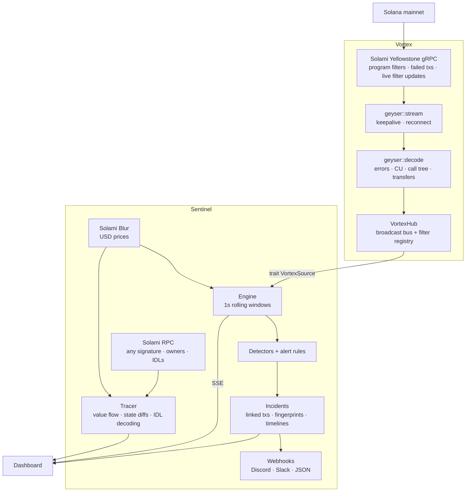

# Vortex Sentinel

**Incidents, not transactions.** Sentinel watches a Solana program on mainnet in real time. It tells you when something breaks, which error is breaking it, which instruction, how many wallets are affected, and the exact transactions. Then it pages you.

It runs on top of [Vortex](https://github.com/Don-Vicks/vortex), my own Solana transaction stack. Vortex handles the Solami stream and decodes each transaction. Sentinel turns that stream into metrics, incidents, investigations and alerts. [What is Vortex, and what's new for this submission?](#built-on-vortex)

<!-- Demo video and screenshots: added after the live mainnet recording. -->



## What it does

- **Live program health.** TPS, failure rate against its baseline, compute units, unique signers and fees, updated every second. The transaction feed streams in as it lands.
- **Failure fingerprints.** Every failed transaction is attributed to the deepest failing frame in its call tree, as *program::instruction → error* (Anchor error names come from logs). For example: "83% of failures are `TooLittleSolReceived` in `Pump.fun::Sell`".
- **Explainable detection.** No ML. Each detector compares a short window against a trailing baseline and states the rule it applied with real numbers:
  - failure-rate spike
  - error-type spike: one error surging against its own baseline, or a never-seen error appearing, even when the overall failure rate looks normal
  - activity spike (mean + zσ)
  - activity stopped
  - compute spike
  - large transfer, by amount per asset or by USD value (Blur-priced, liquid tokens only)

  Seconds inside an open incident are left out of later baselines, so one incident doesn't mask the next.
- **Per-instruction health.** Volume, failure rate and compute per instruction (Buy, Sell, …) over the last 5 minutes.
- **Incident timelines.** The metric around each incident, with baseline, threshold, onset, detection and resolution markers, plus each error type's count over time. The timeline is saved with the incident when it resolves.
- **Anchor IDL decoding.** Sentinel fetches each program's IDL from chain (current and legacy formats). It names instruction accounts (`bonding_curve`, `user`, …), decodes arguments (`amount`, `max_sol_cost`), and translates bare custom error codes into names and messages.
- **Incidents** link to the actual transactions (stored, so they survive the in-memory window). They record affected wallets, onset, peak, detection latency, and auto-resolve.
- **Investigation.** For any transaction, Sentinel shows the items below. Recent and incident-linked transactions come from memory or SQLite; any other signature is fetched through Solami RPC and run through the same Vortex decoder.
  - a plain-language narrative
  - value flow between labelled parties (PDAs are resolved to their owner program through RPC)
  - net balance changes
  - the program call tree with per-program compute
  - account state diffs, instructions and logs
- **Alert rules.** Supported conditions: failure rate, failed count, TPS, avg or max compute over a window, single transfers above a size or a USD value, or any incident above a severity. Each rule can open an incident, POST a webhook (with Discord and Slack formatting), or both. Every delivery is logged with its status and latency.
- **Accounts: Sign-In With Solana.** Your wallet signs a one-time message (domain, nonce, 5-minute expiry). There are no passwords and nothing goes on chain. Each wallet has its own watchlist, alert rules, webhooks and delivery log; a rule only fires for programs its owner watches. Streaming and detection are shared per program, so everyone watching Pump.fun sees the same incidents. Browsing is public and read-only; watching programs and managing alerts need a signed-in wallet.
- **Stream health.** The dashboard shows ingest tx/s, current slot, tip lag in slots, time since the last transaction, and events dropped.

## Built on Vortex

Vortex is not a third-party dependency. It is [my own open-source Rust project](https://github.com/Don-Vicks/vortex), the same author and the same GitHub account. I started it in June as a transaction execution stack: Jito bundles, a tip engine and failure recovery. Its Yellowstone client was already there, and Sentinel's needs went well past it, so I extended Vortex and kept it as the ingest library. Keeping the two apart means Sentinel has no stream-ingest code of its own, which is the point of the audit in [`docs/VORTEX_AUDIT.md`](docs/VORTEX_AUDIT.md). Its Blur, RPC and Beam calls are in this repo.

**What existed before this bounty.** The Yellowstone gRPC client with reconnect, and the transaction-sending stack. Sentinel doesn't use the sending side.

**What I wrote for this bounty (Sep 28 – Oct 1).** 1,842 added lines in Vortex (tests and examples included), all in public commits:

| Piece | Commit |
|---|---|
| Decoder: errors, compute, call tree from logs, SOL/SPL transfers, address lookup tables, version 1 transactions | [`4571b95`](https://github.com/Don-Vicks/vortex/commit/4571b95) |
| `VortexHub`: fan-out of decoded transactions and live program filters | [`4571b95`](https://github.com/Don-Vicks/vortex/commit/4571b95) |
| Rebuilding Yellowstone frames from JSON-RPC, plus tests on real mainnet transactions | [`6973c2d`](https://github.com/Don-Vicks/vortex/commit/6973c2d) |
| Base64 instruction data (6x faster decode) | [`2d252c3`](https://github.com/Don-Vicks/vortex/commit/2d252c3) |
| Solami Mirage WebSocket transport | [`4cbc733`](https://github.com/Don-Vicks/vortex/commit/4cbc733), [`c11de1c`](https://github.com/Don-Vicks/vortex/commit/c11de1c) |

**What lives in this repo.** Everything that makes it a product: about 6,500 lines of Rust for the detectors, rolling metrics, incident engine, investigation and tracing, Anchor IDL decoding, alerts and webhooks, wallet sign-in, the finder, Blur pricing and Beam lookups, plus about 1,400 lines of tests and examples and a 3,900-line React dashboard. Sentinel reaches Vortex through one small trait, [`VortexSource`](src/source.rs).

**Third-party pieces,** all standard: the Solana SDK, the Yellowstone protocol definitions (`yellowstone-grpc-proto`), Tokio, Axum, SQLite and React. The data comes from Solami.

## Numbers

Measured with `cargo run --release --example bench` on real mainnet Pump.fun transactions, one core, Apple M-series laptop:

| Path | Throughput |
|---|---|
| Vortex decoder (Yellowstone frame → `VortexTransaction`) | ~13,000 tx/s (≈75 µs per Pump.fun transaction) |
| Sentinel engine (metrics, detectors, rules, incident linking into SQLite) | ~45,000 tx/s, with a failure storm in progress |

Pump.fun, one of the busiest programs on Solana, runs well below both. Detection runs on a 1-second tick. Each incident records its own detection latency, measured from the triggering transaction reaching Sentinel.

## How Solami is used

| Solami product | Role |
|---|---|
| **Yellowstone gRPC** | The primary data path. One subscription carries slots plus a named transaction filter over every monitored program (`account_include`, failed transactions included). Adding a program in the UI re-sends the filter over the open stream, with no reconnect. The stream answers pings and reconnects with backoff. If it can't connect, Mirage takes over (below). |
| **Blur** | `POST /data/token/price` prices every mint Sentinel sees move, in batches of up to 1000. A new mint is priced within about a second; known ones refresh every 30s. USD appears on the live feed, value-flow edges, balance changes and narratives. It also powers the USD large-transfer detector and "transfer worth ≥ $X" rules. Tokens under $10K liquidity are displayed but never trigger alerts, since one trade can move their price arbitrarily. |
| **RPC** | Anchor IDLs are fetched from chain with `getAccountInfo`. `getTransaction` for investigating any signature (rebuilt into a Yellowstone frame, decoded by Vortex). `getMultipleAccounts` resolves the owners of accounts in a trace, so a vault shows up as "Pump.fun account" rather than a raw address. The canary example sends controlled demo transactions through it. The finder's "which programs does this authority upgrade?" is a `getProgramAccounts` scan over the upgradeable loader, the call RPC + Comet accelerates; results are cached because a ProgramData account never changes owner. |
| **Mirage** | Failover for the stream. Mirage sends the same Yellowstone `SubscribeUpdate` frames over a WebSocket, so Vortex decodes them with the same code as gRPC. After repeated gRPC connection failures Sentinel switches over, shows "Solami Mirage (gRPC failover)" in the status bar, and retries gRPC every two minutes. Mirage's filter is a saved subscription on Solami's side, so it follows the programs that subscription names, not live watchlist changes. Set `SENTINEL_TRANSPORT=mirage` to use it as the primary. |
| **Beam** | Read side only. For any transaction, `GET /swqos/tx/{signature}` shows whether Beam carried it and how it landed: Jito or direct to a leader, region, tip, and how long Beam took to forward it. Transfers to Beam's tip accounts (`GET /onchain/tip-addresses`) are called out in the narrative. Both endpoints are public and need no key. Sentinel does not send through Beam; that needs a swQoS key and a funded wallet. |

## Run it

You need a Solami API key. [Sign up](https://solami.dev/signup); the Pro trial includes gRPC.

### Docker (one command)

```bash
git clone https://github.com/Don-Vicks/sentinel && cd sentinel
cp .env.example .env        # add your Solami key
docker compose up --build
```

### From source

Prerequisites: Rust 1.75+, Node 18+, and `protoc` (Vortex compiles Jito protos). Cargo pulls Vortex from [Don-Vicks/vortex](https://github.com/Don-Vicks/vortex) automatically.

```bash
cp .env.example .env
cd web && npm install && npm run build && cd ..
cargo run --release
```

Open http://localhost:8080. Pump.fun is monitored out of the box; add any program ID from the Overview page. Detectors arm after a two-minute baseline.

### Environment

| Variable | Default | Purpose |
|---|---|---|
| `YELLOWSTONE_ENDPOINT` | — | Solami gRPC endpoint, e.g. `https://grpc.solami.dev` |
| `YELLOWSTONE_TOKEN` | — | Solami API key (sent as `x-token`) |
| `SOLANA_RPC_URL` | — | Solami RPC URL, used for owner labels in traces and by the canary |
| `BLUR_API_KEY` | `YELLOWSTONE_TOKEN` | Solami key with the `DataApi` permission, for USD prices. Leave unset to fall back to the gRPC key |
| `BLUR_API_URL` | `https://api.solami.dev` | Blur REST base URL |
| `BEAM_API_URL` | `https://api.solami.dev` | Base URL for Beam landing and tip lookups |
| `MIRAGE_STREAM_URL` | — | Mirage stream URL, `wss://ws.solami.dev/mirage/stream/{id}?api_key=…`. Enables gRPC failover. Use a key that can only stream |
| `SENTINEL_TRANSPORT` | `grpc` | Set to `mirage` to use Mirage as the primary transport |
| `SENTINEL_PROGRAMS` | — | Comma-separated program IDs to monitor at startup |
| `SENTINEL_PORT` | `8080` | HTTP port (API + dashboard) |
| `SENTINEL_DB` | `sentinel.db` | SQLite file |
| `SENTINEL_PUBLIC_URL` | `http://localhost:8080` | Base URL for incident links in webhooks |
| `SENTINEL_ADMINS` | — | Comma-separated operator wallets. Only they can change shared detection settings, and they skip the caps below |
| `SENTINEL_MAX_WATCHED` | `10` | Programs one wallet can watch |
| `SENTINEL_MAX_RULES` | `25` | Alert rules one wallet can own |
| `SENTINEL_AUTH_PER_MIN` / `SENTINEL_WRITES_PER_MIN` | `20` / `60` | Per-IP limits on sign-in requests and on everything that writes |
| `SENTINEL_TRUST_PROXY` | — | `1` to take the client IP from `X-Forwarded-For` (behind a reverse proxy) |
| `SENTINEL_ALLOW_PRIVATE_WEBHOOKS` | — | `1` allows webhooks to private and loopback addresses (local dev only; blocked by default) |
| `SENTINEL_SIMULATE` | — | **Dev only.** Program ID to feed with synthetic traffic instead of gRPC |

### Frontend development

```bash
cargo run            # API on :8080
cd web && npm run dev   # Vite on :5173, proxies /api
```

## Demo: a controlled incident on mainnet

1. Create a throwaway wallet with a little SOL:

   ```bash
   solana-keygen new -o canary-keypair.json
   ```

2. In Sentinel, monitor the canary wallet's address. Any account works as a filter, not just programs.
3. Add an alert rule for that wallet: **Failed transactions exceed 3 over 60s**, pointing at your webhook (a Discord webhook works well on video).
4. Send failing transactions (invalid UTF-8 memos that land and fail on chain):

   ```bash
   cargo run --example canary -- --count 8 --fail
   ```

The transactions travel Solami gRPC → Vortex decoder → Sentinel rule. An incident opens with the transactions linked, the webhook fires, and the delivery appears on the Alerts page. Each transaction costs about 5,000 lamports plus a small priority fee.

## API

| Method | Path | |
|---|---|---|
| POST | `/api/auth/challenge` | `{pubkey}` → message for the wallet to sign |
| POST | `/api/auth/verify` | `{pubkey, message, signature}` → session cookie |
| POST / GET | `/api/auth/logout`, `/api/auth/me` | End the session / current account and watchlist |
| GET | `/api/status` | Stream health + every program snapshot |
| POST | `/api/resolve` | Paste a program, upgrade-authority address, signature or explorer link; returns the programs it points at `{query}` (public data, no sign-in) |
| GET/POST | `/api/programs` | List / add to your watchlist `{program_id, label?}` 🔒 |
| GET/PATCH/DELETE | `/api/programs/{id}` | Detail (snapshot, 10-min series, recent tx, incidents) / update settings 🔒 / remove from your watchlist 🔒 |
| GET | `/api/programs/{id}/transactions?failed=true` | Recent transactions |
| GET | `/api/incidents?program=` | Incidents, newest first |
| GET/PATCH | `/api/incidents/{id}` | Incident + linked transactions / set `status` |
| GET | `/api/incidents/{id}/timeline` | 10s metric series around the incident |
| GET | `/api/transactions/{signature}` | Decoded transaction + trace |
| GET/POST, PATCH/DELETE | `/api/rules`, `/api/rules/{id}` | Your alert rules 🔒 |
| POST | `/api/rules/{id}/test` | Send a test webhook 🔒 |
| GET | `/api/alerts` | Your webhook deliveries 🔒 |
| GET | `/api/stream?program=` | SSE: `transactions`, `metrics`, `incident`, `alert`, `stream` |

🔒 requires a session (wallet sign-in). Changing an incident's status requires watching its program. Changing a program's detection settings is operator-only (`SENTINEL_ADMINS`), since everyone watching it shares them.

Webhook payloads are JSON with `event` (`sentinel.alert`, `sentinel.incident`, `sentinel.test`), `rule`, `severity`, `program`, `message`, `incident` and `links.incident`. Each request carries an `X-Sentinel-Delivery` id for idempotency.

## Tests

```bash
cargo test
```

`tests/real_transactions.rs` runs fingerprinting and tracing on real mainnet Pump.fun transactions: a failed Buy reached through a bot router, a successful trade, and a version 1 transaction. It asserts, for example, that the failure is attributed to `Pump.fun::Buy → TooMuchSolRequired (6002)`. The decoder itself has matching fixture tests in [Vortex](https://github.com/Don-Vicks/vortex/blob/master/crates/vortex/tests/real_transactions.rs).

`tests/idl.rs` decodes a real mainnet Pump.fun Buy with Pump.fun's real on-chain IDL. It checks the named accounts and decoded arguments against the transfers Vortex decoded independently, plus IDL error naming.

`tests/pricing.rs` runs a mock Blur server with the documented response shape (decimals as strings, key in `x-api-key`). It also checks that USD large-transfer detection ignores thin-liquidity tokens and that a USD alert rule fires on a liquid one.

`tests/auth.rs` drives the real HTTP router through wallet sign-in:
- a valid signature opens a session
- a wrong wallet, a reused nonce or a tampered message are rejected
- public reads work; writes need a session
- one account can't see or delete another's rules, or target programs it doesn't watch
- rules fire only on their owner's programs
- webhooks to private networks are refused

`tests/limits.rs` covers the public-instance guards: watchlist and rule caps (the operator is exempt), operator-only detection settings, watcher-only incident updates, per-IP rate limits, and capped sign-in challenges.

`tests/pipeline.rs` drives the real engine through a full cycle:
- healthy baseline
- failure spike → incident with linked transactions and fingerprints
- auto-resolve
- a second spike judged against a clean baseline
- a webhook delivered to a local receiver

## Limits

- Timestamps are Sentinel's receive time at `Processed` commitment; a transaction on a dropped fork can appear briefly.
- Version 1 transactions carry compute-unit limit and price in a transaction config, not ComputeBudget instructions. Sentinel reports compute used for them, but not the limit or priority fee.
- USD values use Blur's last-trade price at the time Sentinel sees the transfer. A mint seen for the first time is valued about a second later, so its very first transfer can't trigger a USD alert.
- Instruction names come from logs (Anchor `Instruction: X`); arguments and account names need an on-chain Anchor IDL, which most major programs publish. Truncated logs lose names beyond the cut.
- Metrics and recent transactions live in memory (15 min). Incidents and their transactions are persisted. Detector state resets on restart, and incidents left open are closed out.

See [docs/VORTEX_AUDIT.md](docs/VORTEX_AUDIT.md) for how Sentinel was fitted onto the existing Vortex code: what was reused, extended and built new.
